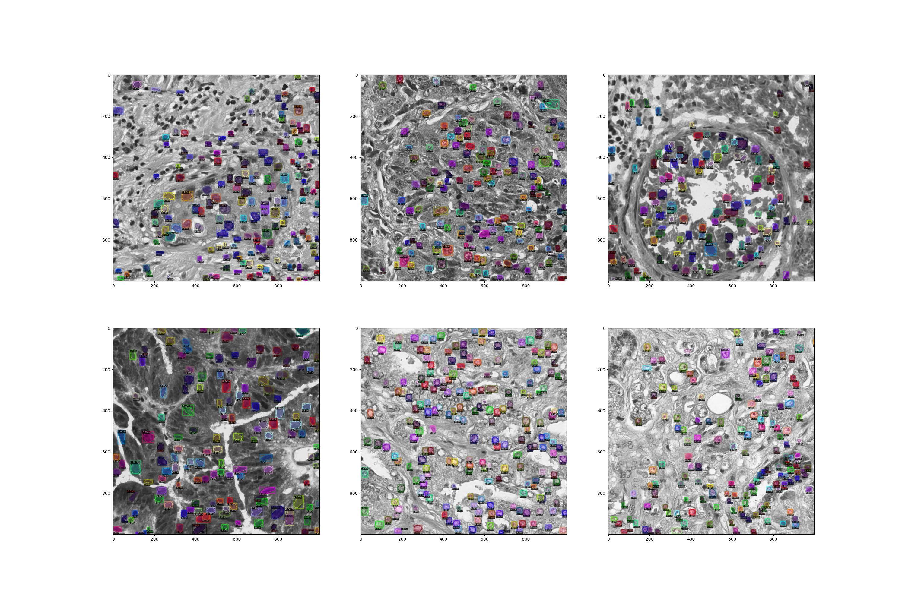

# VRDL_LW3

## Introduction

Something

## Reproduce answer.json

Download model weight from [GDrive LINK](https://ppt.cc/f25Ffx)

Make sure to run below script after finishing [environment setting](#Installation).

```sh
git clone https://github.com/cemeteryparty/VRDL_LW3.git
cd VRDL_LW3/
python3 tools/gdget.py 1nEJ7NTtHcCHNQqUXaoPk55VH3Uwh4QGG -O dataset.zip
unzip -qq dataset.zip -d ./
python3 inference.py --model-path detectron2_nuc_model.pth \
	--testset-path dataset/test --testset-info dataset/test_img_ids.json \
	--output-path results --config mrcnn_R50_config.yaml

# OR use provided script directly
./answer.sh
```

The `answer.json` will be generated under `results` directory.

## Installation

```sh
git clone https://github.com/cemeteryparty/VRDL_LW3.git
cd VRDL_LW3/
```

### Activate environment ###

```sh
conda create --name ENV_NAME python=3.7
conda activate ENV_NAME
```

### Install Library ###

```sh
# PyTorch (Required before install detectron2)
pip install torch
pip install torchvision

# detectron2 repo
git clone https://github.com/facebookresearch/detectron2.git
cd detectron2/
pip install -e .
cd ../

# Other library
pip install opencv-python
pip install scikit-learn
pip install scikit-image
pip install tensorflow
pip install pandas
pip install clodsa
```

## Dataset Preparation

### Download dataset provided in GDrive

```sh
python3 tools/gdget.py 1nEJ7NTtHcCHNQqUXaoPk55VH3Uwh4QGG -O dataset.zip
unzip -qq dataset.zip -d ./
rm -rf dataset.zip
```

### Form COCO Format Dataset and Perform Data Augumentation

```sh
# Original Dataset TO COCO Format
python3 gen_anno.py
# Data Augumentation
python3 data_aug.py --input-path styleCOCO --output-path aug_styCOCO/
```

## Train Process
```sh
python3 train.py --dataset-path aug_styCOCO --anno-path aug_styCOCO/annotation.json \
	--config mrcnn_R50_config.yaml --output-path weightsCOCO
```

## Inference

```sh
python3 inference.py --model-path best_total_loss_model.pth \
	--testset-path dataset/test --testset-info dataset/test_img_ids.json \
	--output-path results --config mrcnn_R50_config.yaml
```

## Prediction Result


## Reference  

https://github.com/facebookresearch/detectron2

https://github.com/vbnmzxc9513/Nuclei-detection_detectron2
